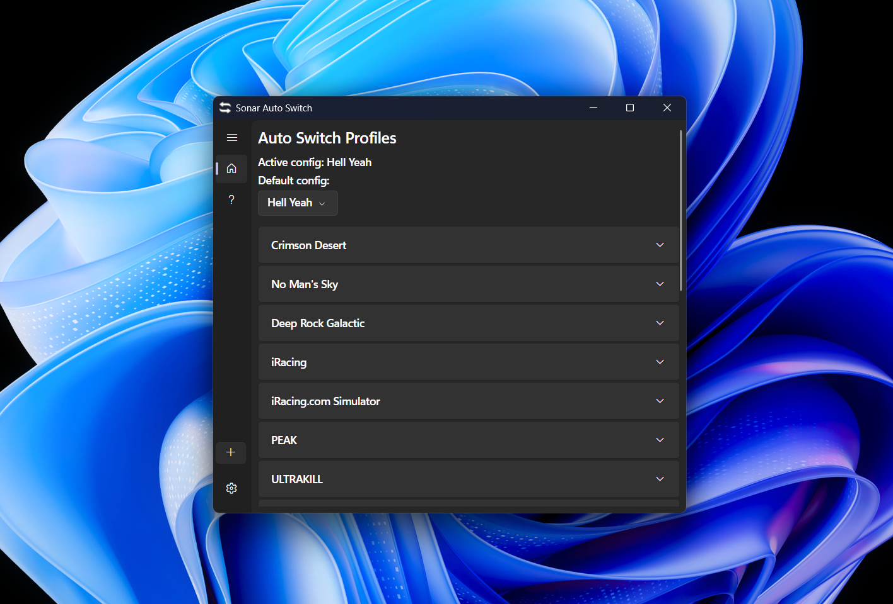

# Sonar.AutoSwitch — Continued

A continuation of [adirh3/Sonar.AutoSwitch](https://github.com/adirh3/Sonar.AutoSwitch).
Automatically switches your SteelSeries Sonar gaming audio profile when a game comes into focus.



## How to use

1. Download `Sonar.AutoSwitch.exe` from the [latest release](https://github.com/janikithup/SonarAutoSwitch-Continued/releases/latest).
2. Run it — it sits in the system tray.
3. Set a **Default config** — this applies when no game profile matches.
4. Add a profile per game using the **+** button. Click a profile to expand it and set:
   - **Executable name** — the process name without `.exe` (check Task Manager). Autocompletes from running processes.
   - **Window title** — use this instead for games like Valorant where the exe can't be read.
5. That's it. Switch to a game and Sonar switches with it.

## Build

Requires .NET 8.

```powershell
cd Sonar.AutoSwitch
dotnet publish -c Release -r win-x64 --self-contained true -p:PublishSingleFile=true
```
